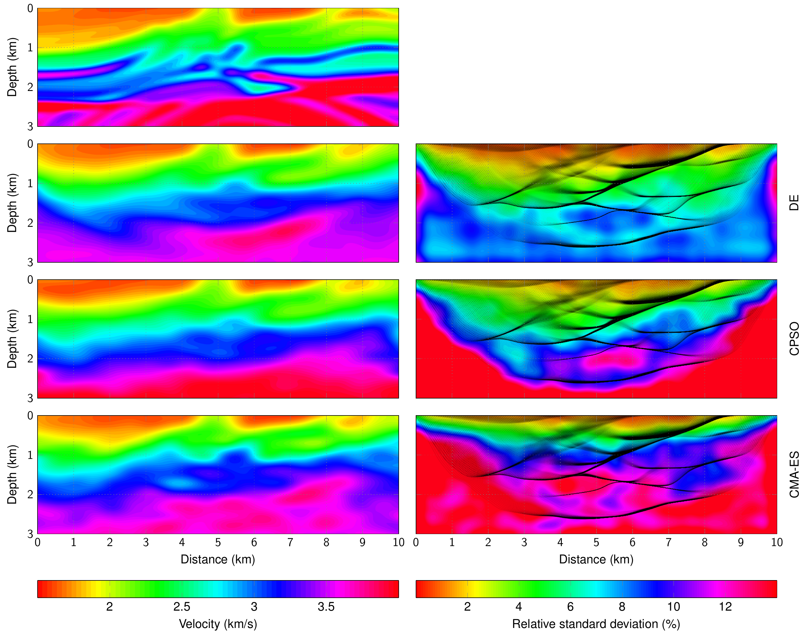

# Toward large scale stochastic refraction tomography: a comparison of three evolutionary algorithms

## Abstract

The main goal of this study is to assess the potential of evolutionary algorithms to solve highly non-linear and multi-modal tomography problems (such as first arrival traveltime tomography) and their abilities to estimate reliable uncertainties. Classical tomography methods apply derivative-based optimization algorithms that require the user to determine the value of several parameters (such as regularization level and initial model) prior to the inversion as they strongly affect the final inverted model. In addition, derivative-based methods only perform a local search dependent on the chosen starting model. Global optimization methods based on Markov Chain Monte Carlo that thoroughly sample the model parameter space are theoretically insensitive to the initial model but turn out to be computationally expensive. Evolutionary algorithms are population-based global optimization methods and are thus intrinsically parallel, allowing these algorithms to fully handle available computer resources. We apply three evolutionary algorithms to solve a refraction traveltime tomography problem, namely the Differential Evolution, the Competitive Particle Swarm Optimization and the Covariance Matrix Adaptation - Evolution Strategy. We apply these methodologies on a smoothed version of the Marmousi velocity model and compare their performances in terms of optimization and estimates of uncertainty. By performing scalability and statistical analysis over the results obtained with several runs, we assess the benefits and shortcomings of each algorithm.

**Keywords** : evolutionary algorithms, global optimization, uncertainties, non-linear inversion, tomography

